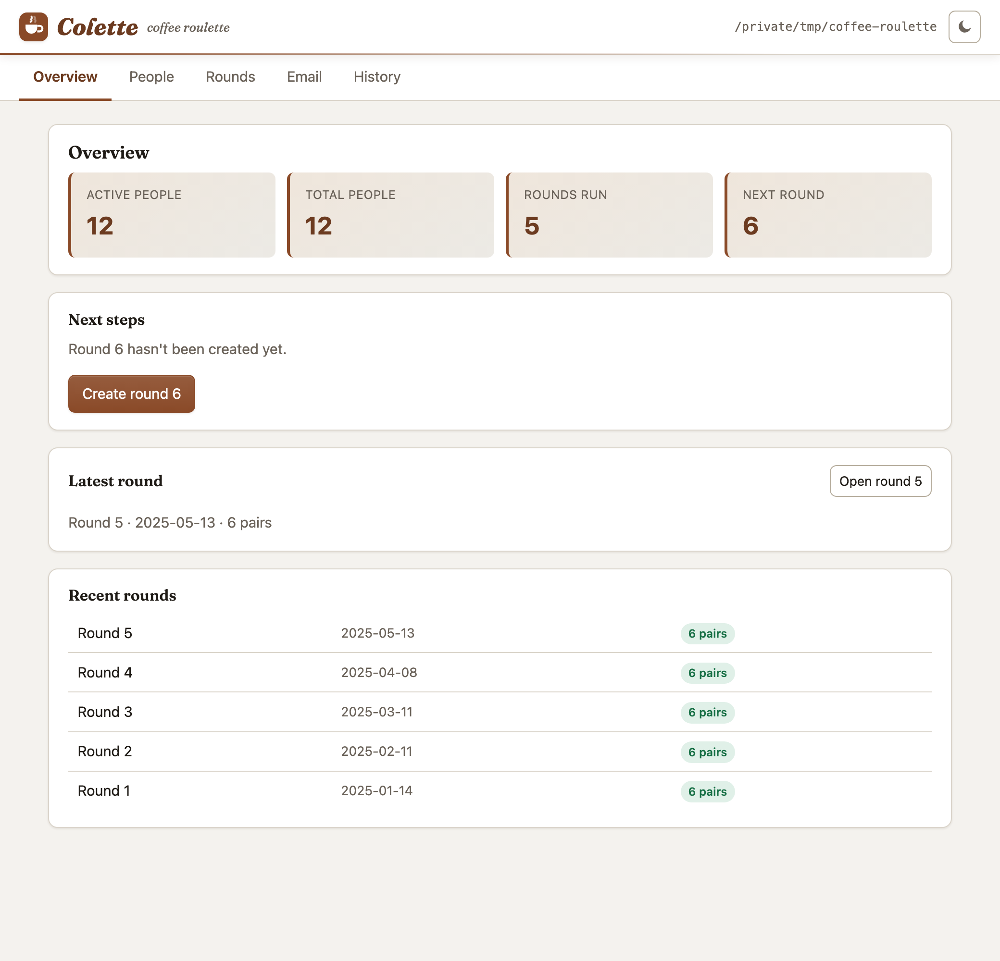

# Colette: Coffee Roulette — pair people up for a coffee

Colette organises pairings within an organisation or community — coffee
roulettes, mentoring, networking, or any other kind of regular meet-up.

It's aimed at organisations that want to encourage cross-team collaboration, or
communities that want to encourage networking. As you run more rounds it keeps
track of who has already met whom and tries to minimise repeat pairings. It can
also, optionally:

- avoid pairing people from the same organisation or group;
- give each person a role in the pair — for example one to organise the meet-up
  and the other to buy the coffee — swapping the roles from round to round;
- force specific pairs together, or keep them apart;
- email everyone their match via Outlook, Mail.app or SMTP.

You can drive Colette from the command line, or from a small built-in web
interface that reads and writes exactly the same files:

<p align="center">
  
</p>

Colette is written in Python and is available on
[PyPI](https://pypi.org/project/colette/).

## Contents

- [Installation](#installation)
- [Setting up a working directory](#getting-started)
- [Running the roulette from the command line](#running-the-roulette)
- [The web interface](#web-gui)
- [Tips](#tips)

## Installation

Colette requires Python 3.10+, and some familiarity with the command line.

Python can be obtained from [official Python distribution](https://python.org), or
[Anaconda](https://www.anaconda.com/products/individual) but be aware of the
non-free licensing of the latter. You will need to add python to your PATH.

To install the package run the following code in the command line

    pip install colette

Check the installation by running the following command:

    colette --help

This should print the help message.

## Getting started

Colette keeps everything for one roulette in a single working directory — a
folder of plain-text files that you can edit by hand, keep in version control,
or manage through the [web interface](#web-gui). The web interface can create
all of these for you (it even shows a "Getting started" checklist when pointed
at an empty folder), so if you'd rather not hand-edit files, skip ahead to
[The web interface](#web-gui) and come back here when you want the details.

A working directory can contain the following files:

| File/Directory          | Description                                                                                                          |
|-------------------------|---------------------------------------------------------------------------------------------------------------------|
| `people.csv`            | List of participants, in the format described in the [next section](#peoplecsv).                                     |
| `round_*.toml`          | One configuration file per round (round number, date, and any removals/overrides). Created by `colette new`.        |
| `solution_*.toml`       | Pairings generated by Colette for a round. A matching `solution_*.csv` copy is written too for easy viewing.         |
| `templates/subject.txt` | Jinja2 template for the email subject line (optional — only needed for email).                                       |
| `templates/body.html`   | Jinja2 template for the email body, plain text or HTML (optional — only needed for email).                          |
| `email.ini`             | Optional SMTP configuration. If absent, Colette uses the default mail client on your computer.                      |


### People.csv
You will need a `people.csv` comma separated value file with the following header

    name,organisation,email,active

You can create one with your favourite spreadsheet, or text editor.
Each participating (or previously participating) player should be listed on an
individual row with the following comma separated values:

-  `name` &mdash; the name of the player. This is the only field that must be
   non-empty, and it is used to identify the player everywhere else.

-  `organisation` &mdash; whatever grouping makes sense for your programme.
    Colette will try to avoid pairing people from the same "organisation" value.
    Leave it blank if you don't want to use this functionality.

-  `email` &mdash; the email address of each player, if you want to use the email
   functionality.

- `active` &mdash; used to mark players as no longer participating in the
roulette. (You can also use round configuration files to temporarily remove
players from a single round — discussed below.) Must have one of the following
values:

  - `1`, `true` or empty == active,
  - `0` or `false` == inactive.

Other columns in the CSV are ignored, and can have any format.

### Templates

If you want to use the email functionality, you will need to create
templates for the email subject and body. These are plain text files, use
the Jinja2 templating language, and are stored in the `templates` directory.

For example, the `subject.txt` file could look like this:

    Coffee Roulette ({{ round_config.date.strftime('%b-%Y') }})

Which will print the month and year of the round in the subject line.
Eg. "Coffee Roulette (Jan-2021)"

In the `body.html`, you can either use plain text, or HTML, for example

```html
<html>
<head></head>
<body>
Hi {{primary.name.split()[0]}} and {{secondary.name.split()[0]}},
<p>
The most advanced AI south of Campbell Town has been thinking long and
hard, and it has decided that it would be optimal for you two to have a
coffee this month.

<p>
Feel free to reschedule the time as it suits you! (It's not that clever.)

<div>
Cheers, <br>
The Coffee Robot <br>
</div>
</body>

</html>
```

The `primary` and `secondary` variables are populated people from the
`people.csv` file. If you wish to assign particular meaning or roles to the
`primary` and `secondary` designations, you can do so here.

Note Colette will try to swap the `primary` and `secondary` roles for a player
in each round, so that each player has a turn at being the "organiser" and the
"buyer".


### email.ini

If using SMTP email, you will need to create an `email.ini` file.
If you want to use Outlook or Mail.app, you remove this file.
This needs the following format:

```ini
[email]
from = Joe Bloggs <email.name@emailprovider.com>
server = smtp.emailprovider.com
port = 587
ssl = true
username = email.name@emailprovider.com
password = thepasswordfortheaccount
```

### Round configuration files (`round_*.toml`) (generated)

Colette will generate a `round_*.toml` file for each round.

At a minimum, this file contains the round `number` and a nominal `date` for the
round &mdash; which Colette uses to work out who is available (via the `until`
dates on any removals). For example:

```toml
number = 28
date = 2023-11-06
```

These files can be also be used to specify players that are temporarily removed
from the round, overrides, and other preferences. If you want to
temporarily remove a player from the round, you can add a `[[remove]]` block to
the file, with the `name` of the player and the date or round number they should
be removed until.

For example:


```toml
## By round number:
[[remove]]
name = "Mary Poppins"
until = 29
# Mary is on holiday until next round

## Or by date:
[[remove]]
name = "Joe Bloggs"
until = 2044-01-01
# Joe is in jail for the next 20 years
```


You can also add overrides to the round configuration file. For example, if you
want to avoid pairing two people, you can add a `[[override]]` block to the
file, with the `pair` of players and a `weight` to add to the cost of pairing

For example:

```toml
[[override]]
pair = ["Mary Poppins", "Joe Bloggs"]
weight = 1000000
# Mary and Joe are mortal enemies
# Joe made Mary's umbrella fly away
# Mary made Joe's coffee fly away
# They should never be paired
```

The `weight` is added to the cost of pairing the two players. So if you want to
prioritise pairing two people, you can add a negative weight. For example:

```toml
[[override]]
pair = ["Joe Bloggs", "Jane Doe"]
weight = -1000000
# Joe and Jane are in love
# They should always be paired
```

Each `[[override]]` block takes exactly a `pair` and a `weight` — these are the
only keys allowed.

### Solution files (`solution_*.toml`)

When you make a pairing, Colette writes a `solution_*.toml` file for the round.
This is the canonical format it reads back, and it lists each pairing along with
any caveats (for example, that the pair has met recently or share an
organisation):

```toml
cost = 6
round = 28

[[pair]]
primary = "Joe Bloggs"
secondary = "Mary Poppins"
caviats = ["paired before"]

[[pair]]
primary = "Jane Doe"
secondary = "Thomas Tank"
caviats = ["paired before", "same organisation"]
```

For convenience a matching `solution_*.csv` copy is written alongside it, with a
`primary,secondary,caveat` header (caveats joined by semicolons) so you can open
the pairings in a spreadsheet.

To **import an existing programme**, you can create the solution files by hand —
either format works. The only requirement is that each pairing has a `primary`
and a `secondary` name; Colette will read the `.csv` files and convert them to
`.toml` the next time it runs.

The order of `primary` and `secondary` doesn't matter if you aren't assigning
roles in the pairings.

## Running the roulette

Once you have the files, you're ready to create a round. In the command line,
run:

    colette new

> [!NOTE]
>
> You may need to add the location pip installed `colette` to your `PATH`
> environment variable.
>
> Alternatively you can run colette as
>
>     python -m colette

This generates the next round's configuration file. Make any changes you want to
the file (see above), and then make a pairing by running:

    colette pair

Inspect the `solution_*.toml` file (or the `.csv` copy) to make sure you're
happy with the pairings. If you want to make changes, edit the `round_*.toml`
file, delete the round's solution files (both `solution_*.toml` and
`solution_*.csv`), and run `colette pair` again. (The [web interface](#web-gui)
can do this for you with its "Save & regenerate" button.)

Once you are happy with the pairings, you can send the emails by running:

    colette email

By default, this will preview the emails in your default mail client. If you
want to send the emails, you can add the `--no-preview` flag:

    colette email --no-preview

Happy rouletting! Any problems with the program itself, file an issue
on the [Colette GitHub project](https://github.com/dehorsley/colette/issues).

## Web GUI

If you'd rather click than type, Colette ships with a small local web interface
— it's the gentlest way to get started, and it's pictured at the top of this
README. From your working directory run:

    colette web

This starts a server on <http://127.0.0.1:8080>, opens it in your browser, and
reads and writes the same `people.csv`, `round_*.toml` and `solution_*.toml`
files as the command line — so you can move between the two freely. (`colette
serve` still works as a hidden alias.)

Point it at an empty (or not-yet-created) directory to start from scratch: the
Overview shows a short "Getting started" checklist that walks you through adding
people, optionally setting up email templates, and running the first round.

From the GUI you can:

- **People** — add, edit, activate/deactivate or remove participants, or paste a
  whole list at once ("Import several at once").
- **Rounds** — create the next round, set its date, temporarily remove people
  (optionally "until" a round number or date), let someone "sit out" of an
  odd-numbered round, and nudge specific pairs together or apart — then generate
  the pairings. On a generated round you can push any individual pair apart with
  the "×" button to get a fresh draw. Edits support **undo/redo** with the usual
  keyboard shortcuts (Ctrl/⌘+Z, add Shift to redo).
- **Email** — edit the subject/body templates with a live preview rendered from
  example participants (no round needed); a sensible starter template is shown
  for a new directory. You can also preview a generated round's real emails. The
  web interface never sends mail — use `colette email` for that.
- **History** — look up who anyone has been paired with, on which rounds (and
  dates), and see which pairings have repeated.

A light/dark theme toggle sits in the top-right corner; it follows your system
setting by default.

Useful options:

    colette web --port 9000     # listen on a different port
    colette web --no-browser    # don't open a browser automatically
    colette --path ./my-roulette web

The server binds to `127.0.0.1` (localhost) only and has no authentication, so
it is intended to be run on your own machine. Like the rest of Colette, it needs
only the Python standard library — no extra dependencies required.


## Tips

### Start a `round_*.toml` early

It can be useful to start a `round_*.toml` file early, and use it to keep track
of people who are going to be away.

As people let you know they are going to be away, add them to the `[[remove]]`
section. This can make things easier when you come to generate the round.


### Handling odd numbers

If you have an odd number of people, Colette has to leave someone out of the
round. This is recorded by pairing that person with themselves.

If you'd like to influence who is left out — say, you the organiser — add a
self-override to the round file (`round_*.toml`):

```toml
[[override]]
pair = ["Your Name", "Your Name"]
weight = -900
```

Overrides are additive, and the default cost of leaving a player out
(`cost_of_not_pairing`) is 50. A negative weight makes that person cheaper to
leave out, so a clearly negative value like `-900` makes them the first choice
to sit out. (In the web interface, "Allow to sit out" does the same thing.)


### Importing existing programmes

If you already have a history of pairings, you can import it by creating solution
files in the working directory, e.g. `solution_000001.csv`,
`solution_000002.csv`, … Either format works — Colette reads the `.csv` files and
converts them to `.toml` on the next run. The only requirement is that each
pairing has a `primary` and a `secondary` name.


### Upgrading from v0.1.x

If you are upgrading from v0.1.x, you will need to change your templates. The
`subject.txt` and `body.html` files should now be in the `templates` directory,
instead of the old `organiser.template`, `buyer.template` and
`excluded.template` files.

You will also need to update your old solution files. The `organiser` and
`buyer` names are now `primary` and `secondary` in the solution files. You will
need to change your templates to reflect this. You can do so with the following
`sed` command (backup first!)

    sed -i 's/organiser/primary/g' solution_*.csv
    sed -i 's/buyer/secondary/g' solution_*.csv
